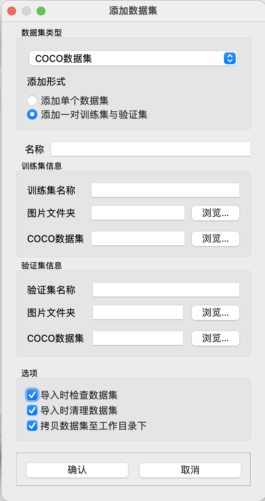

# Dataset GUI

一个基于 PySide2 图形化的数据集管理工具，目前支持对 coco, yolo-pose 数据集的管理，可以在 Windows, macOS, Linux 上运行。

> 作者：[Li Yanxiao](https://github.com/yan-xiaoo)
>
> GitHub 地址: [gitHub.com/yan-xiaoo/DatasetGUI](https://github.com/yan-xiaoo/DatasetGUI)
>
> 本项目依照 MIT 协议开源。详情请见 [协议](./LICENSE)

本项目目前包含以下功能：

- 添加一个数据集（coco 或 yolo 格式）
- 复制（已添加的）数据集
- 将数据集划分为训练集与验证集
- 将 coco（Object-detection 格式），yolo-pose 格式的数据集相互转换
- 压缩并导出数据集，以便直接发送单个文件
- 删除数据集
- 检查数据集
  - 检查数据集的图片是否都被标注
  - 检查数据集标签对应的图片是否存在
  - 检查数据集内是否有多余文件（除标签和图片外的文件）

本项目会持续更新。Bug 修复与新功能将在 [Github 仓库](https://github.com/yan-xiaoo/DatasetGUI)上发布，您可以选择 Star 或 Watch 本仓库以便获得最新动态。

## 安装方法

1. 下载 Python。请参考您的电脑操作系统对应的教程。

2. 安装必要的依赖。必需的依赖已经在 requirements.txt 中列出。

   `pip install -r requirements.txt`

3. （可选）安装可选的依赖。

   本项目目前没有可选的依赖。但在未来的版本中，可能会添加对直接训练 yolov8 数据集的支持，此时需要额外安装 ultralytics 包。

4. 运行程序：使用 Python 运行 main.py

## 使用教程

### 第一次使用？

第一次打开程序后，您可以使用 「文件」 菜单下的 「添加数据集…」 选项来添加数据集。您可以选择添加 coco 或者 yolo 格式的数据集。如果您的数据集已经被分为了训练集和验证集，您可以在 「添加形式」 部分选择「添加一对训练集与验证集」，并在下方分别填入您训练集和验证集的位置。

下方的选项中，「导入时检查数据集」和「导入时清理数据集」仅在数据集为 coco 格式时可用，可以在导入前执行检查数据集中的工作。

「拷贝数据集至工作目录下」会将数据集整个复制到 main.py 目录下的 dataset 子文件夹中。如果不选择此选项，则删除数据集的时候，不能自动的清除数据集的文件。

添加一个数据集后，您应该可以在主窗口中看到数据集了。双击 或者右键数据集并选择「详情…」可以进入数据集操作窗口，本程序的绝大部分功能都在此处。右键并选择「删除数据集…」可以快捷删除数据集。

### 数据集操作窗口

数据集操作窗口包含了大部分本程序的功能

#### 基本信息

在这部分，您可以重命名数据集，重新选择数据集的图片文件夹和标签，以及快速浏览数据集的位置。

「在系统中显示」会使用与相应文件类型关联的程序打开您的数据集的位置。比如，点击图片位置的「在系统中显示」会打开您系统的文件管理器，点击标签的「在系统中显示」可能会打开 vscode 以显示 json 文件（假设您的电脑以 vscode 作为 json 文件的默认打开方式）

请注意，您在此部分的所有修改**需要点击「更新信息」后才会生效**。如果您不点击「更新信息」按钮而关闭了窗口，您更改的内容不会被保存。

#### 操作

这部分包含本程序大部分的功能。灰色的按钮通常为本项目计划制作，但尚未完成的功能。您可以在此选择自己需要的功能。

## 开发者

### 本项目的结构

-- Ui

-- Libs

​    -- Dataset

​    -- Ui

​    -- Widget

​    [其他常用功能]

main.py

Ui 文件夹下存放了使用 Qt Designer APP 设计的本程序的UI文件。您可以自行修改这些文件，以改变本程序的样式。

Libs 文件夹下存放本程序几乎所有的 Python 代码

- Dataset 文件夹下存放了对数据集进行操作的 Python 程序。您或许可以从这里找到一些可用的，不需要依赖于图形界面的接口

- Ui 文件夹下存放了由 Qt 的 UI 文件通过 pyuic 生成的 Python 代码。

  如果您想要修改图形界面的内容，请在上层的 UI 文件夹内修改后，使用 pyuic 生成 Python 文件并覆盖此文件夹下的对应文件，以便让您的修改在程序中生效。

  请不要直接修改此文件夹下的代码。因为从 pyuic 重新生成后，您的所有修改都会丢失。

- Widget 文件夹下存放了定义每个窗体行为的 Python 代码。这些窗体的样式由 UI 文件夹下的对应 Python 文件决定。如果您想要更改程序处理数据的方式，比如更改按下某个按钮后执行的函数，请在此处进行修改。

## 未来计划

本部分包含本项目可能会添加的功能。请注意，这些计划不一定都会实现，也不一定会在短时间内实现。

- 标注功能

  借助 OpenCV 的GUI部分，实现在程序中对 yolo-pose 类型数据集标注的支持。

- 训练功能

  利用 ultralytics 包，实现本地对 yolov8 模型的训练，验证和预测

- 视频取流功能

  利用 OpenCV 的 VideoCapture 等视频接口，从视频中按照用户想要的时间段与帧率提取图片，方便制作数据集。

